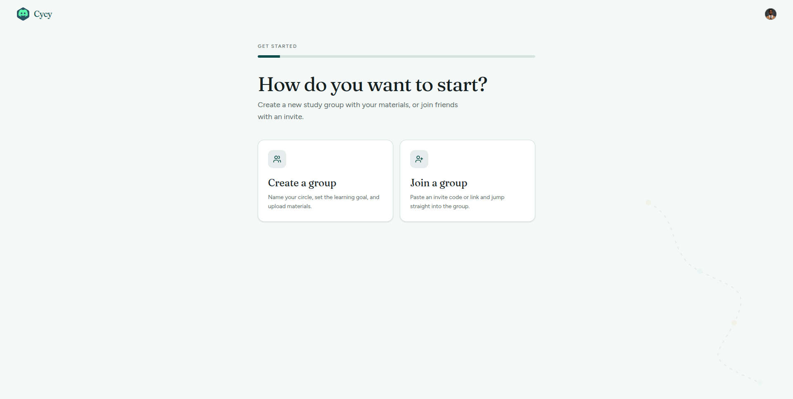
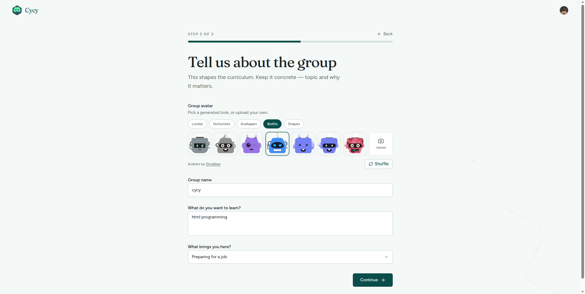
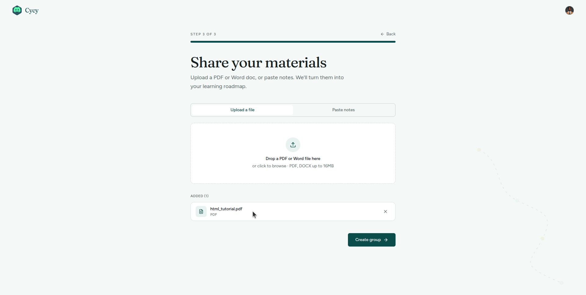
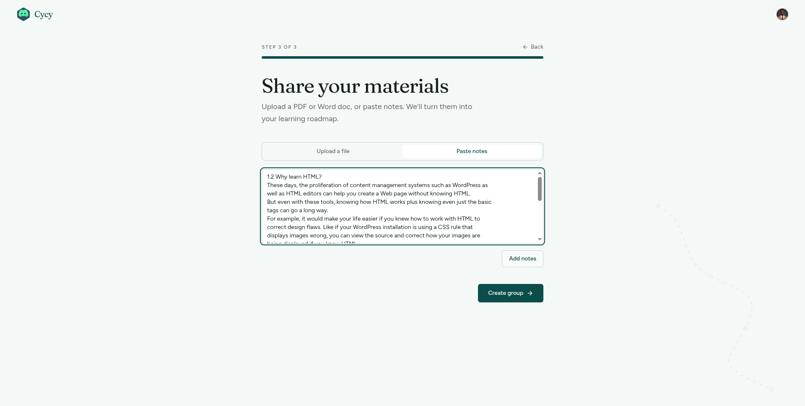
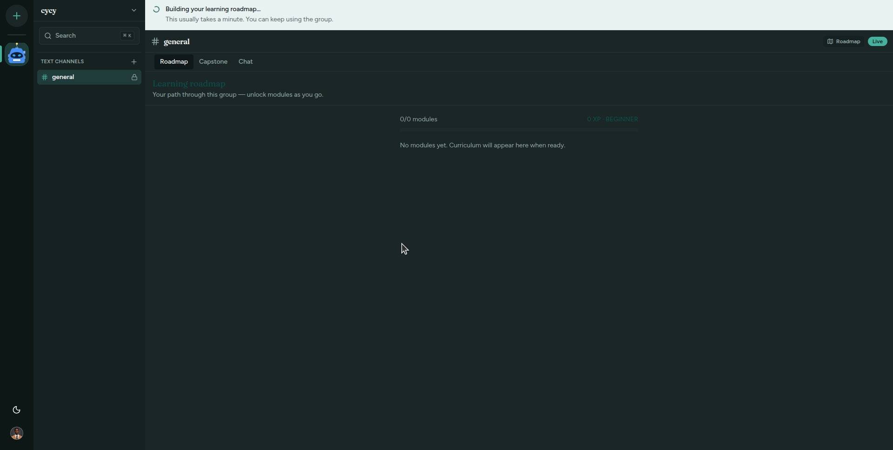
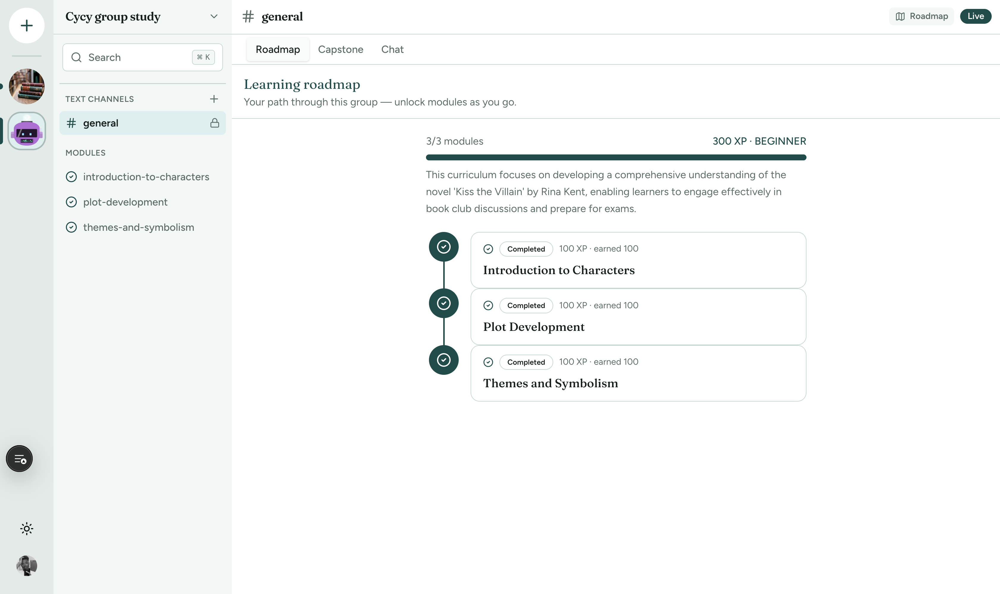
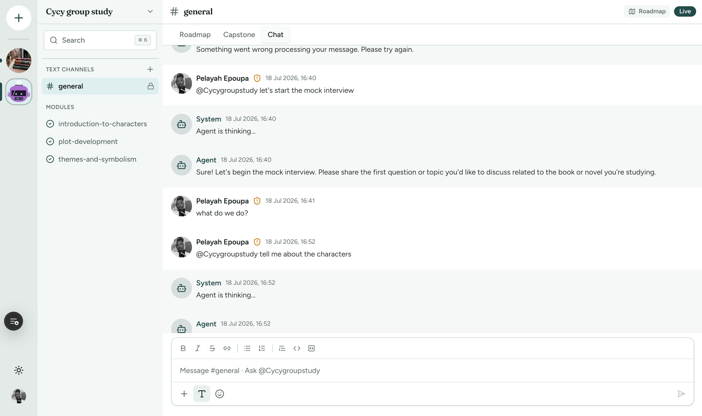
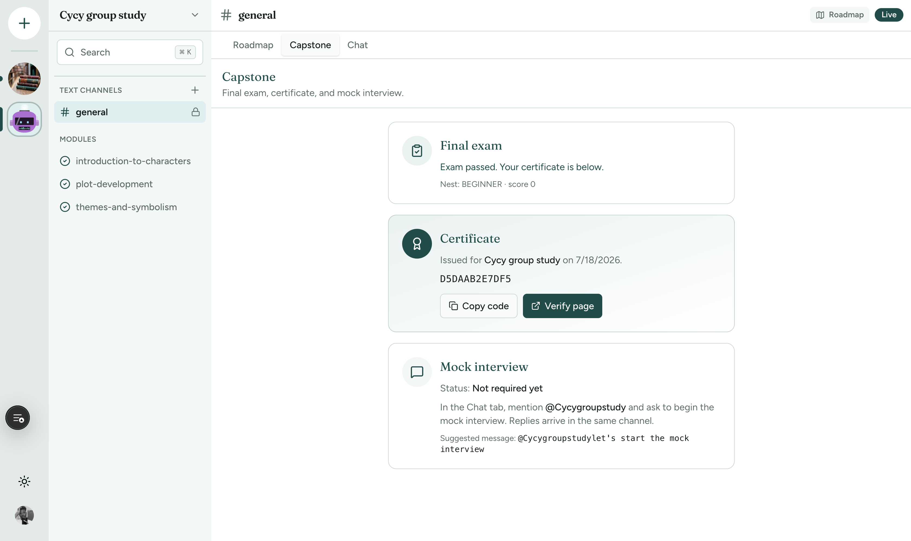
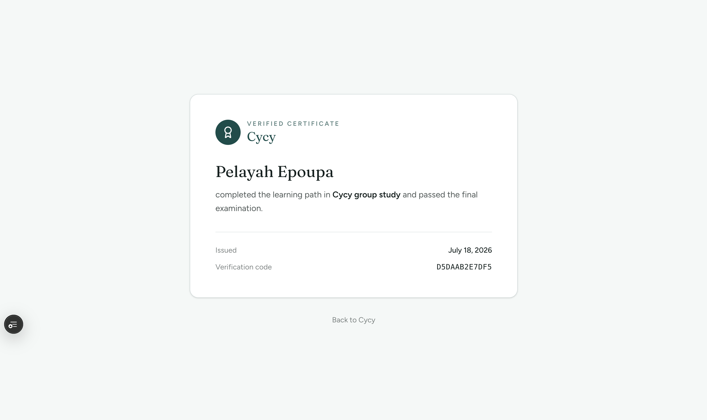

# Cycy — Submission

**Tagline:** Study together. Finish with proof.

**Live app:** [https://cy-cy.vercel.app](https://cy-cy.vercel.app)
**AI backend / API docs:** [https://cycy-backend.onrender.com/api/docs](https://cycy-backend.onrender.com/api/docs)
**Frontend repo:** [github.com/Peliah/cycy](https://github.com/Peliah/cycy)
**AI backend repo:** [github.com/G4EVA-dev/cycy-backend](https://github.com/G4EVA-dev/cycy-backend)

---

## Problem

Students who study alone often can't tell if they actually understand something until it's too late — the exam. Existing tools each solve one slice of the problem and leave the rest for the student to stitch together:

- **Quizlet / flashcard apps** — drill without diagnosis; wrong is wrong, with no insight into *why*.
- **ChatGPT / generic AI tutors** — answer whatever is asked, but keep no persistent model of what a specific learner does and doesn't understand.
- **Duolingo** — strong gamification and retention, but content is broad and hobbyist, not mapped to real coursework.
- **Study groups / Discord servers** — social accountability exists, but there's no structured curriculum or diagnostic layer underneath the chat.

Nobody combines real subject teaching, targeted diagnostic practice, and optional social accountability into a single loop — so motivated learners keep switching between five disconnected apps and still can't see their own gaps until it's graded.

## Solution

Cycy turns every set of study materials into an **AI-built roadmap** inside a shared study group. Studying, practicing, and reviewing happen in one guided loop — not across five disconnected apps — and the platform names the specific misconception behind a wrong answer instead of just marking it incorrect.

**How it works, end to end:**

1. **Create or join a group** — start a study circle or arrive with an invite code; same goal, same space.
2. **Upload materials** — PDFs, Word docs, or pasted notes.
3. **Get an AI roadmap** — the backend's 8-agent Mastra workflow turns those materials into a module-by-module path scoped to what the group actually uploaded.
4. **Learn concept by concept** — each module runs a study → quick check → practice → explain-back → spaced review loop inside the group's own chat.
5. **Get diagnosed, not just graded** — misses surface a typed misconception and a targeted micro-drill instead of a vague "incorrect," and a module only unlocks the next one once its gate check is passed.
6. **Finish with proof** — clearing the final stage (capstone, mock interview) issues a certificate with a unique verification code, publicly viewable at `cy-cy.vercel.app/certificates/[code]` — a shareable proof of completion instead of another abandoned course streak.

**Why this needs AI:** a conventional app can store files and host a group chat, but it can't read a group's own uploaded materials and turn them into a personalized roadmap, or tell a learner which specific concept they're missing. That reasoning — content-aware curriculum generation plus per-answer misconception diagnosis — is the part only the AI agent workflow can do.

## Live Link

**[https://cy-cy.vercel.app](https://cy-cy.vercel.app)**

## Screenshots

**1. Start a group** — create a new study circle or join with an invite.

  

**2. Set up the group** — name it, state the topic, and say why you're here so the AI can tune tone and pacing.

  

**3. Upload materials** — drop in a PDF or Word doc.

  

**4. Or paste notes instead** — raw text works just as well as a file.

  

**5. The AI builds the roadmap** — curriculum generation runs right inside the group's chat.

  

**6. Follow the roadmap** — modules unlock as they're completed, each one scored in XP.

  

**7. Learn in the agent chat** — mention the agent to study, practice, or start a mock interview.

  

**8. Finish the capstone** — pass the final exam to unlock the certificate and mock interview.

  

**9. Get a verifiable certificate** — publicly viewable proof of completion.

  

*(See [`cycy-screenshots/README.md`](cycy-screenshots/README.md) for the exact files in this folder.)*

## What the AI Does

The AI layer runs as a separate **NestJS + Mastra** service ([cycy-backend](https://github.com/G4EVA-dev/cycy-backend)), called from the frontend and backed by an OpenAI-compatible model (`OPENAI_API_KEY`, or an OpenRouter key):

- **Curriculum bootstrap agent** — reads uploaded materials and generates the module roadmap.
- **Learning-loop agents** — drive study, quick checks, practice, and explain-back per module, inside the member's own agent conversation.
- **Diagnosis agent** — classifies incorrect answers into a specific misconception type and generates a targeted micro-drill.
- **Gate-check agent** — verifies mastery before unlocking the next module.
- **Closing agents** — run the capstone / mock interview and issue the final certificate.

## Who Built It

- **Peliah** ([github.com/Peliah](https://github.com/Peliah)) — frontend: Next.js app, real-time chat, learning UI, onboarding
- **G4EVA-dev** ([github.com/G4EVA-dev](https://github.com/G4EVA-dev)) — AI backend: NestJS + Mastra 8-agent learning workflow
